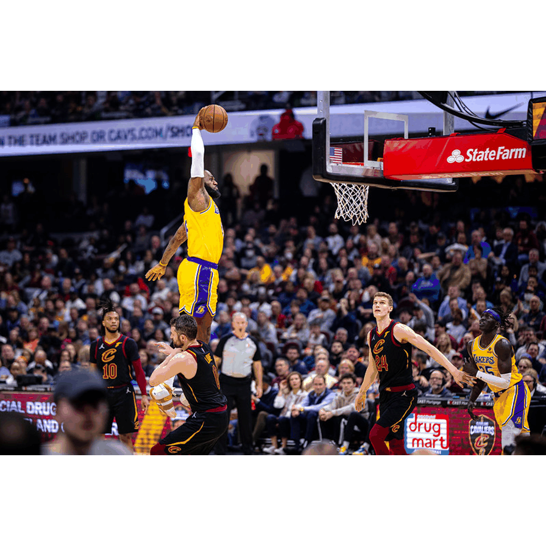
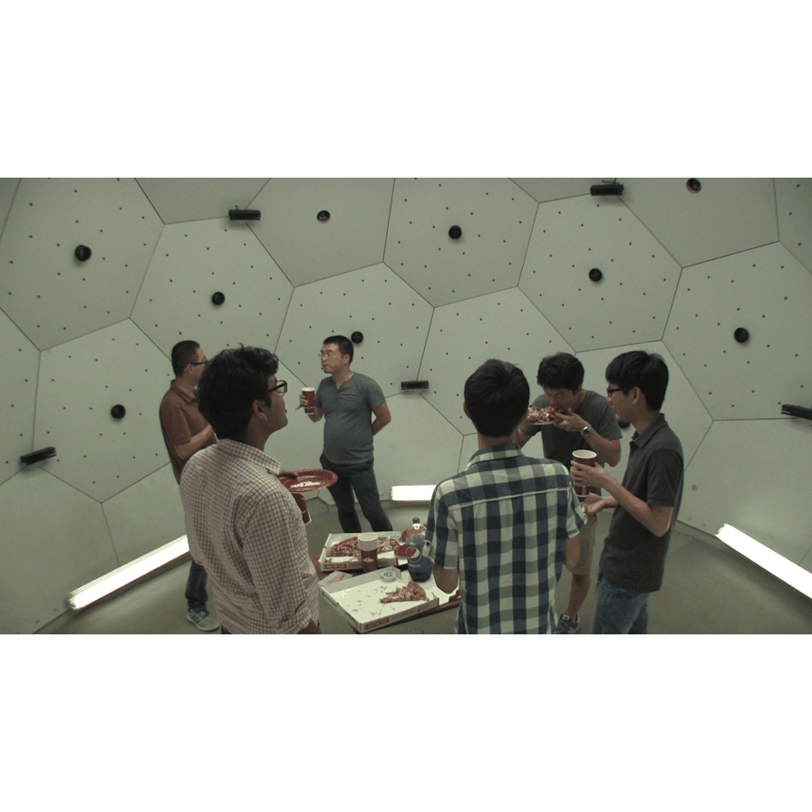

> **Thesis readers:** this README is the upstream Multi-HMR documentation. The thesis contributions, experiment chain and results protocol are in [THESIS.md](THESIS.md).


<p align="center">

  <div align="center">
  
  

  <br>
  Multi-HMR is a simple yet effective single-shot model for multi-person and expressive human mesh recovery.
  It takes as input a single RGB image and efficiently performs 3D reconstruction of multiple humans in camera space.
  <br>
</div>
</p>

# Multi-HMR with the Anny body model

Master's thesis code: extending [Multi-HMR](https://github.com/naver/multi-hmr) (single-shot multi-person human mesh recovery) to predict the [Anny](https://github.com/naver/anny) body model instead of SMPL-X, compressing it by knowledge distillation, and converting real-world 3DPW ground truth into Anny's parameter space so the model can be trained and evaluated on real photos.

RPTU Kaiserslautern-Landau / DFKI. Supervisor: Muhammad Saif Ullah Khan. All training runs on DFKI's Pegasus cluster (Slurm + Enroot containers); the `*.sh` files are the exact job scripts used.

Based on Multi-HMR by NAVER (ECCV 2024, non-commercial licence, see `LICENSE.txt` / `NOTICE.txt`). Everything in this repository that is not in the original Multi-HMR release was written for the thesis.

---

## What the model does

Input: one RGB image. Output: for every detected person, 163 Anny bone rotations (6D), 11 Anny phenotypes (gender, age, muscle, weight, height, proportions, cup size, firmness, african/asian/caucasian), 2D location and depth. A DINOv2 ViT backbone produces patch tokens; a detection MLP finds people; a cross-attention head ("HPH") regresses the body parameters per person.

Two model classes exist and are **not** interchangeable:

| class | file | checkpoint key prefix | used by |
|---|---|---|---|
| `Model` | `model.py` | `backbone.encoder.*` | `train.py`, our checkpoints |
| `Multi_HMR` | `multi_hmr_anny/multi_hmr.py` | `encoder.backbone.*` | Naver's released checkpoints |

Loading one into the other with `strict=False` silently loads nothing. `train.py --pretrained_remap 1` renames the backbone keys; `inspect_ckpt.py --compare` tells you which class a checkpoint fits.

---

## Repository layout

```
model.py, loss.py, train.py          training code (Model class, losses, trainer)
distill.py                           knowledge-distillation loss + frozen teacher loader
apply_student_fix*.py                patches that added the distillation flags to train.py / model.py
demo.py                              inference + rendering, with the inference-time toggles below
smpl_to_anny.py                      3DPW SMPL -> Anny ground-truth conversion (Track B)
render_anny_fit.py                   overlays a converted body on the 3DPW frame for visual checks
check_anny_fit.py, npz_to_annyone.py sanity checker / converter to Anny-One label format
*_export.py, sample_images.py        pull images + per-image FOV out of AnnyOne / 3DPW for demos
check_*.py, compare_*.py, phenotype_stats.py, inspect_*.py   diagnostics (see "Diagnostics")
train_*.sh, run_*.sh                 Slurm job scripts, one per experiment, in run order
conda.yaml, requirements.txt         environment
```

---

## Setup

### Environment

```bash
conda env create -f conda.yaml      # python 3.9, torch 2.0.1, roma, smplx, pyrender, anny
conda activate multihmr
```

DINOv2 is fetched through `torch.hub`; on Python 3.9 its type hints must be patched (every job script does `sed -i 's/ | None//g'` on the cached copy). Rendering needs EGL; the demo scripts install the NVIDIA EGL vendor file inside the container.

### Data and weights (not in this repo, all licensed)

| what | where it is expected | source |
|---|---|---|
| Anny-One dataset (~580k synthetic images) | `/netscratch/<user>/anydataset/` | Naver, with Anny |
| 3DPW (images + sequenceFiles) | `/ds-av/public_datasets/3DPW/original/*.zip`, extracted to `data/3DPW/` | [3DPW](https://virtualhumans.mpi-inf.mpg.de/3DPW/), registration required |
| `SMPL_NEUTRAL.pkl` | `models/smpl/` | [SMPL](https://smpl.is.tue.mpg.de/), registration required |
| `multiHMR_672_L_anny.pt`, `multiHMR_672_S.pt` | `models/multiHMR/` | Naver Multi-HMR release |

Nothing in this list may be redistributed; do not commit them.

---

## Track A: training the Anny model

### Teacher (ViT-L) — done

Best checkpoint: `anny_s2_shape_v5`, epoch 99 (318M params).
Holdout (last 100 Anny-One samples, never trained on): **PVE 73.6 mm, PA-PVE 56.5, MPJPE 73.2**.

How it was reached, one job script per step:

1. `train_step1_pretrained_bb.sh` / `train_step2_frozen_bb.sh`: backbone from `multiHMR_672_L_anny` (`--pretrained_remap 1 --load_only_backbone 1`), fresh heads; full fine-tune vs frozen backbone.
2. `train_s2_partialft.sh`: unfreeze the last 4 ViT blocks + mask the 88 Anny helper bones out of the rotation loss (`--mask_helper_joints_train 1`). PVE 145 → 75.
3. `train_s2_boosted_v4.sh`: per-joint loss boost on neck and hands (`loss.py`, `--boost_neck_weight`). No measurable gain.
4. `train_s2_shape_v5.sh`: `--alpha_shape 20`. Fixed the shape head: age error +0.199 → −0.001, height −0.154 → −0.026 against Anny-One ground truth.
5. `train_v6_resume*.sh`, `train_v7_scratch.sh`, `train_v8_*.sh`: continuation / clean-baseline runs.

Known limitation: the rendered neck looks elongated. Four candidate causes were eliminated by measurement (body model via `--rest_pose`, helper mask via `check_mask_boost.py`, domain gap via in-domain demos, shape via `compare_gt_pred_shape.py`); what remains is linear blend skinning across Anny's stacked neck bones, a rig property.

### Student (ViT-S) by knowledge distillation — in progress

`distill.py` + flags in `train.py`. Feature-level KL on backbone patch tokens (temperature 4, channel softmax, T² scaling), optional output-level L1 (`--lambda_kd_out`), optional head transfer from the teacher (`--init_heads_from_teacher`, `--freeze_heads_epochs`), and from v6 a projector that feeds the heads teacher-width tokens (`--head_dim 1024`).

| run | script | change | holdout PVE |
|---|---|---|---|
| v1/v2 | `train_distill_vits.sh`, `_v2.sh` | feature KD, random heads | 228 at ep0 → 193.4 (PA-PVE 128) |
| v3 | `_v3.sh` | + teacher heads + output KD | 274 at ep45 |
| v4 | `_v4.sh` | + HMR-trained ViT-S backbone, colour jitter, batch 8 | 251 at ep25 |
| v5 | `_v5.sh` | + 5-epoch head freeze | 315 at ep5 |
| v6 | `_v6.sh` | + projector-fed heads (67/67 tensors transfer) | pending |

The HMR-pretrained student backbone (v4) is the one change that clearly helped. Head transfer has not beaten random heads yet; v6 is the decisive test of that idea, with "v4 without head transfer" as the fallback.

### Evaluation

`run_eval_test.sh` evaluates a checkpoint on the Anny-One holdout with PVE, PA-PVE, MPJPE, PA-MPJPE and detection precision/recall (`--eval_only 1 --test_anny_n 100`). Always read recall next to PVE: the mesh metrics are computed only over matched detections.

---

## Track B: converting 3DPW ground truth from SMPL to Anny

3DPW labels are SMPL parameters; the model speaks Anny. `smpl_to_anny.py` fits Anny's 163 rotations + 11 phenotypes + translation to the 24 SMPL joints of each frame by staged gradient descent (root → root+pose → +shape), one shared body per sequence, and writes an `.npz` with everything `render_anny_fit.py` needs to put the mesh back on the photo.

```bash
# inspect both rest skeletons and the joint correspondences (no fitting)
python smpl_to_anny.py --check_mapping --smpl_model_path models/smpl/SMPL_NEUTRAL.pkl
# convert one sequence and render it           (Slurm: run_smpl_to_anny.sh, MODE=fit_and_render)
python smpl_to_anny.py --pkl data/3DPW/sequenceFiles/test/outdoors_fencing_01.pkl \
    --smpl_model_path models/smpl/SMPL_NEUTRAL.pkl --out threedpw_anny_v21/outdoors_fencing_01.npz \
    --max_frames 40 --frame_stride 25
python render_anny_fit.py --npz threedpw_anny_v21/outdoors_fencing_01.npz \
    --img_dir data/3DPW/imageFiles/outdoors_fencing_01 --out renders/outdoors_fencing_01
# four diverse scenes at once                    (run_smpl_to_anny_scenes_v21.sh)
```

Progress on `outdoors_fencing_01`, 38 frames, all 24 joints:

| version | mean joint error | what changed |
|---|---|---|
| v1 | 34.3 mm | name-based joint mapping; same error floor and same (female) body for every scene |
| v2 | 24.6 mm | mapping checked by rest-pose geometry (spine numbering was reversed, hips on the wrong bone); targets = 3DPW's own `jointPositions`; gender fixed from the data; only skeletal phenotypes fitted |
| v2.1 | **15.8 mm** | torso joints fitted as rest-pose-measured "virtual joints" inside the bone frame; bone mask; warm start between frames; shared-body refine pass. Torso rows 13–22 mm, limbs 4–12 mm, 11 s/frame |

The renderer draws SMPL ground-truth joints (red) and fitted Anny joints (green) on the overlay, so "camera/frame plumbing is right" and "the fit is right" can be judged separately. (v1's renders were drawn on the wrong images: 3DPW's `img_frame_ids` is the 60 Hz index map, not the image number.)

`npz_to_annyone.py` turns a fit into Anny-One-style label pickles for mixed synthetic + real training (next step).

---

## Demo

```bash
# real photos (run_demo.sh): detector-guided crops, helper-bone mask, neutral hands
python demo.py --model_name <ckpt> --img_folder example_data --out_folder demo_out \
    --use_person_detector 1 --mask_helper_joints 1 --relax_hands 1 --fov 55
# AnnyOne images (run_demo_syn.sh): in-domain, per-image FOV from the dataset
python anyone_image_export.py --n 10 --split holdout --out annyone_demo_images
python demo.py --model_name <ckpt> --img_folder annyone_demo_images --use_person_detector 0 \
    --fov_json annyone_fov.json
```

Inference-time toggles added to `demo.py`: `--mask_helper_joints`, `--relax_hands`, `--rest_pose`, `--neutral_phenotypes`, `--no_filter`, `--fov_json`. Units differ between the real-photo path (cm) and the in-domain path (m); the renderer auto-detects them. AnnyOne images each have their own camera (FOV 51–118° measured), so a single global `--fov` mis-places meshes; always pass the per-image map.

---

## Diagnostics

| script | question it answers |
|---|---|
| `inspect_ckpt.py`, `inspect_prefix.py` | which model class does this checkpoint fit; how many tensors would actually load |
| `check_mask_boost.py` | are the boosted neck/hand bones also masked (loss = 0)? |
| `compare_gt_pred_shape.py`, `run_shape_check.sh` | predicted vs ground-truth phenotypes on the same holdout images |
| `phenotype_stats.py` | ground-truth phenotype distribution of Anny-One (e.g. are there children at all?) |
| `check_shape.py`, `explore_anny.py`, `test_loader.py` | dataset fields, phenotype label order, dataloader smoke test |
| `check_anny_fit.py` | validity, per-joint error, left/right mirror test and 3D overlays of a conversion `.npz` |

---

## Rules learned the hard way

- Always a fresh `--name` per run: checkpoint cleanup keeps the 10 highest epoch numbers, so resuming into an old folder deletes the new checkpoints immediately.
- Verify weight loading by count (`N/M tensors, X%`); `strict=False` hides failures.
- Resume with roughly 1/10 of the cold-start learning rate, and size the decay schedule to the epoch budget (v1 distillation decayed to 4e-7 by epoch 240 and stopped learning).
- The 6D rotation identity is indices (0, 3), not (0, 4): the latter makes Gram-Schmidt divide by zero and every fit NaN.
- `/ds-av` must be in `--container-mounts` or 3DPW does not exist inside the job.
- Diagnose by elimination with measurements, not by guessing; three wrong hypotheses preceded the right one on the NaN bug and four on the neck.

---

## Status (October 2026)

- Teacher: done, evaluated.
- Distillation: v6 (projector-fed heads) running; decision rule: holdout PVE clearly below 228 and PA-PVE below 128 at epochs 5–10, else fall back to random heads with the HMR-pretrained backbone.
- 3DPW conversion: v2.1 at 15.8 mm on the fencing scene; four-scene run and supervisor's visual check pending; then the mixed synthetic + 3DPW student run.
- Thesis draft (`main.tex`) written with placeholders for the runs above.

